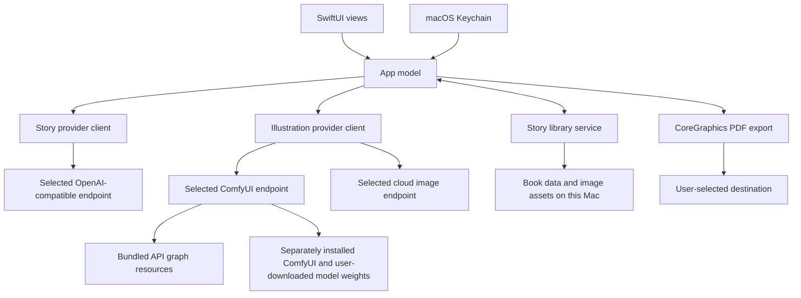

# StoryPress architecture

StoryPress keeps story writing, illustration, library storage, and export behind separate service boundaries. The macOS app controls the workflow; model servers are optional endpoints that users configure.

## App and provider boundaries

SwiftUI views collect edits and show progress. The app model coordinates services and is responsible for keeping an edit made during a network request. Story planning and illustration use separate provider settings, so changing one does not change the other. Users select each provider explicitly; an error does not trigger cloud fallback.

Story providers use the OpenAI-compatible chat-completions shape. Model discovery and story generation go only to the configured endpoint. Cloud API keys are read from Keychain and added to requests at send time; the saved library and settings contain no secret values.

Illustration providers also stay separate. ComfyUI is local-first and speaks its own API. The app posts a workflow to `/prompt`, watches `/history/{prompt_id}`, then fetches the generated file from `/view`. The default ComfyUI address is `http://127.0.0.1:8188`; a user can configure another endpoint. StoryPress bundles workflow graphs but does not bundle ComfyUI, Python, or model weights. The optional setup script installs a pinned ComfyUI checkout and venv in a separate per-user runtime directory, downloads only the weights required by the bundled Qwen Image 2.1 graphs, and verifies their published hashes. The start script runs the service in the foreground on loopback.

## Local library and export

Book records use Codable JSON with a schema version. StoryPress writes each new record atomically and stores illustration and reference image files beside the book record. Asset references are relative to the owning book, and reads reject paths that escape that directory.

PDF export lays out image and text as real page content using CoreGraphics. A user chooses the destination through the macOS save panel; export does not send a book to a StoryPress service.

## Trust and data flow

Story text, prompts, settings, and artwork remain in the local library unless the user sends them to a selected provider. Cloud endpoints receive the fields needed for the requested operation, including any reference image the user chose to upload. For ComfyUI, reference uploads and generated output travel to the configured ComfyUI server. Use a server the user controls or trusts, and use HTTPS for remote endpoints where available.

The downloaded Qwen Image 2.1 files carry the [Qwen Research License](https://github.com/QwenLM/Qwen-Image-2.1/blob/fb7ae1d1f9611cd91524d03c53c5246b36ac8577/LICENSE). That agreement defines “Non-Commercial” as research or evaluation, limits the grant to non-commercial purposes, and requires a separate license for commercial use. The app source license does not grant rights to third-party models or outputs.
